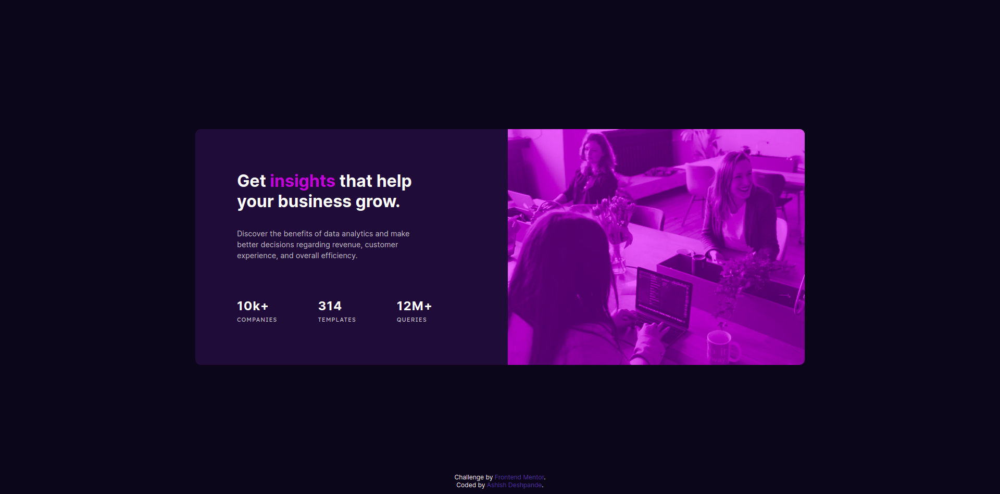

# Frontend Mentor - Stats preview card component solution

This is a solution to the [Stats preview card component challenge on Frontend Mentor](https://www.frontendmentor.io/challenges/stats-preview-card-component-8JqbgoU62). Frontend Mentor challenges help you improve your coding skills by building realistic projects. 

## Table of contents

- [Frontend Mentor - Stats preview card component solution](#frontend-mentor---stats-preview-card-component-solution)
  - [Table of contents](#table-of-contents)
  - [Overview](#overview)
    - [The challenge](#the-challenge)
    - [Screenshot](#screenshot)
    - [Links](#links)
  - [My process](#my-process)
    - [Built with](#built-with)
    - [What I learned](#what-i-learned)
    - [Continued development](#continued-development)
    - [Useful resources](#useful-resources)
  - [Author](#author)
  - [Acknowledgments](#acknowledgments)

## Overview
Responsive stats preview card representing some arbitrary statistics for some product/solution.

### The challenge

Users should be able to:

- View the optimal layout depending on their device's screen size

### Screenshot
* Desktop Preview

* Mobile Preview

### Links

- Solution URL: [Github Repo](https://github.com/ashish1189/stats-preview-card-component)
- Live Site URL: [Add live site URL here](https://your-live-site-url.com)

## My process

### Built with

- Semantic HTML5 markup
- CSS custom properties
- Flexbox

### What I learned

As beginner this was quite a challenge for me. Learned or I would say i began to learn css now.

### Continued development

Need to focus on Flexbox, and how to style media queries

**Note: Delete this note and the content within this section and replace with your own plans for continued development.**

### Useful resources

## Author

- Website - [Ashish Deshpande](https://github.com/ashish1189)
- Frontend Mentor - [@ashish1189](https://www.frontendmentor.io/profile/ashish1189)

## Acknowledgments

Various CSS tutorials on Youtube.
